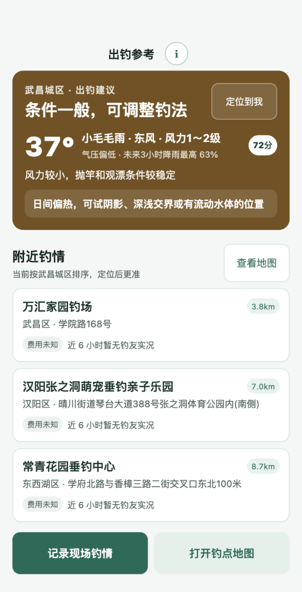
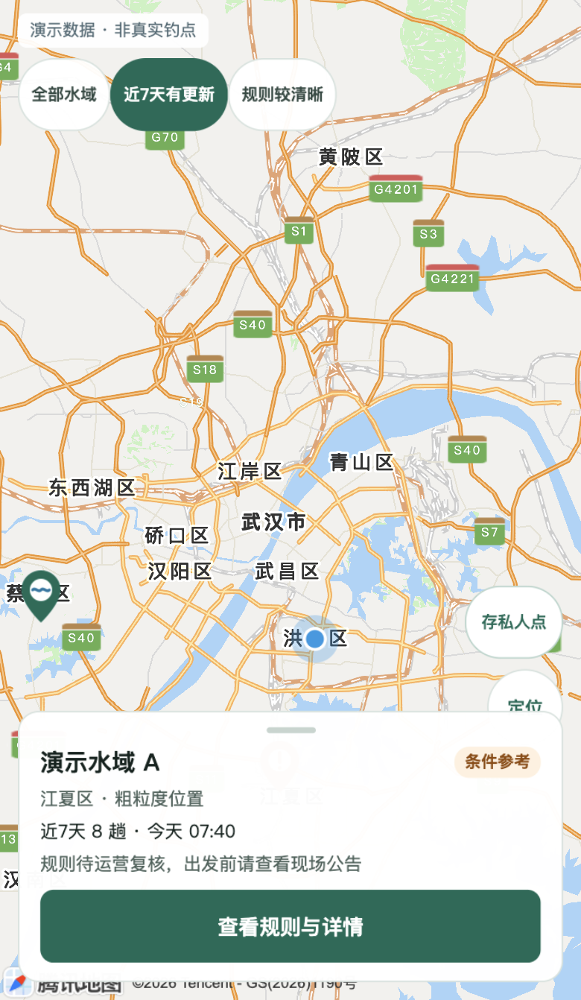
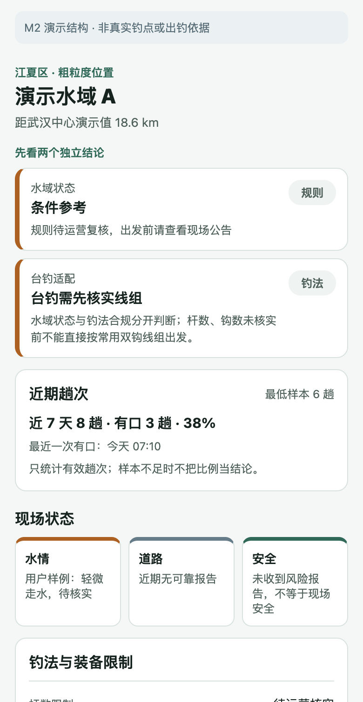
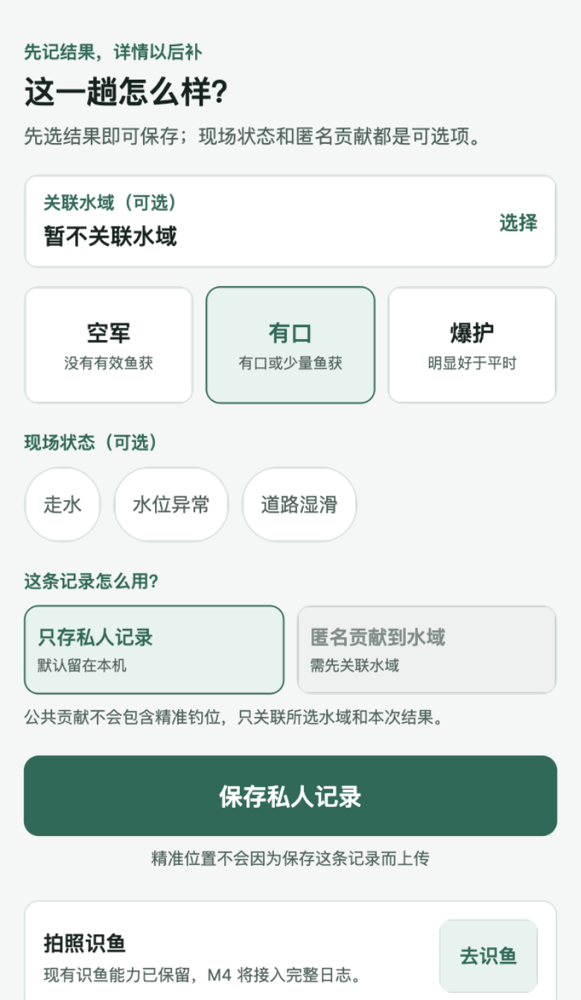

# 🎣 Play Holiday

> 武汉台钓出钓决策与私人记录微信小程序 —— 出发前先看天气、规则和真实钓情，再决定去哪钓。

一款面向武汉台钓爱好者的微信小程序：聚合真实公开钓点资料，结合实时天气给出**可解释**的出钓建议，并支持地图选点、现场钓情记录与拍照识鱼。当前已导入 664 条武汉真实公开钓点（182 条带来源坐标），保留 1,587 条历史评论与 964 条图片记录。

<p>
  
  
  
  
  
  
</p>

## 界面预览

| 出钓首页 | 钓点地图 | 钓点详情 | 现场记录 |
| :---: | :---: | :---: | :---: |
|  |  |  |  |
| 定位后按距离排序附近钓点，顶部给出天气评分与钓法建议 | 腾讯底图渲染 10km 半径钓点，可按更新时间/规则清晰度筛选 | 水域状态与台钓适配分开判断，只聚合近 6 小时样本 | 空军/有口/爆护一键记录，精准钓位默认只留本机 |

> 地图与详情截图使用演示数据占位；首页与记录为真实数据界面。

## 功能特性

- **出钓决策首页**：按用户定位展示附近钓点，顶部给出实时天气评分（温度、气压、风力风向、降雨概率）与「清晨傍晚更稳妥」这类可解释建议；未授权定位时降级为武汉城区。
- **钓点地图**：基于微信内置地图（腾讯底图），首次进入按球面距离渲染半径 10km 内钓点；用户拖动或缩放后切换为当前视野查询。
- **实时钓情**：钓点详情可提交结构化现场钓情（鱼口、拥挤度、水情/道路/安全），幂等写入数据库；各页面只聚合近 6 小时样本，样本不足不算百分比。
- **私人记录**：一趟出钓「空军 / 有口 / 爆护」一键保存，可选匿名贡献到水域；精准钓位默认只保存在本机，不随记录上传。
- **拍照识鱼**：现有识鱼能力的保留版，后续里程碑会把确认结果写入私人趟次日志。
- **数据诚实**：原始来源无坐标的记录只进列表、禁用地图与导航，绝不伪造坐标；历史评论标记为外部内容，不计入站内趟次。

## 技术栈

| 层 | 技术 |
| --- | --- |
| 小程序 | Taro 4.2 · React 18 · TypeScript · Less（Vite 编译） |
| 后端 API | Fastify 5 · Prisma 7 · sharp（图片处理） |
| 数据库 | MySQL / MariaDB |
| 天气 | [Open-Meteo](https://open-meteo.com/) Forecast API（后端代理，10 分钟坐标网格缓存） |
| 地图 | 微信小程序内置地图 / 腾讯底图（`Taro.openLocation`） |
| 测试 | Node Test Runner · miniprogram-automator（原生 E2E） |

## 架构概览

```
微信小程序 (Taro/React)
   │  HTTP  (PLAY_HOLIDAY_API_BASE_URL，默认 http://127.0.0.1:3100)
   ▼
Fastify API  ──►  MySQL (Prisma)        钓点 / 评论 / 图片 / 实时钓情
   │
   └──►  Open-Meteo Forecast API        按坐标取天气，10 分钟网格缓存
```

## 目录结构

```
src/                  小程序源码
  pages/              出钓 / 地图 / 记录 / 我的 / 识鱼 五个主 Tab
  package-water/      分包：钓点详情
  package-ops/        分包：外部线索
  services/           API 调用封装
server/               Fastify + Prisma 后端
  src/services/       weather-service（Open-Meteo）等
  prisma/             schema 与 seed
initdata-script/      武汉钓点数据采集与可重复导入产物
docs/                 PRD、技术方案、里程碑、E2E 覆盖说明
tests/                单元 / 冒烟 / E2E 测试
```

## 本地运行

**前置要求**：Node ≥ 22.12、pnpm 10、本地或远程 MySQL、微信开发者工具。

```bash
# 1. 安装依赖
pnpm install --frozen-lockfile

# 2. 配置后端环境变量（复制后按需修改）
cp server/.env.example server/.env

# 3. 初始化数据库并导入种子数据
pnpm server:db:migrate
pnpm server:db:seed

# 4. 启动后端 API（默认 http://127.0.0.1:3100）
pnpm server:dev

# 5. 编译小程序（watch 模式）
pnpm dev:weapp
```

用微信开发者工具导入项目根目录，工具会根据 `project.config.json` 加载 `dist/`。API 地址可用 `PLAY_HOLIDAY_API_BASE_URL` 覆盖。

### 环境变量（`server/.env`）

| 变量 | 说明 |
| --- | --- |
| `DATABASE_URL` / `DATABASE_*` | MySQL 连接串与账号（运行账号仅授予增删改查） |
| `SERVER_HOST` / `SERVER_PORT` | API 监听地址，默认 `127.0.0.1:3100` |
| `WEATHER_API_BASE_URL` | Open-Meteo 端点，默认公共免费端点 |
| `WEATHER_API_KEY` | 商业端点密钥，非商业原型可留空 |

## API 一览

| 方法 | 路径 | 说明 |
| --- | --- | --- |
| `GET` | `/api/health` | 健康检查 |
| `GET` | `/api/places` | 钓点列表（含无坐标记录） |
| `GET` | `/api/places/map` | 当前视野内钓点（仅带坐标） |
| `GET` | `/api/places/nearby` | 按定位就近的钓点 |
| `GET` | `/api/places/:id` | 钓点详情 |
| `GET` | `/api/weather` | 按经纬度的天气与出钓建议 |
| `POST` | `/api/places/:id/live-reports` | 提交现场钓情（幂等写入） |
| `POST` | `/api/images` | 上传图片 |
| `GET` | `/api/images/:id` | 读取图片 |

## 测试与质量

```bash
pnpm verify      # 前后端类型检查 + 小程序构建 + 单元/冒烟/API 测试
pnpm test:e2e    # 在本地 API 和微信开发者工具上跑真实数据 E2E
```

`test:e2e` 覆盖真实数据列表、搜索、详情、无效 ID、无坐标禁用与记录离线队列。数据采集脚本见 `initdata-script/`，后端运维详见 `server/README.md`。

## 数据边界与隐私

- 运行时核心页面不使用 Mock 钓点。
- 原始来源未给出经纬度的记录只进入列表，地图和导航按钮禁用，不伪造坐标；带坐标的新数据作为独立钓点导入。
- 钓点详情、首页、列表、地图只聚合近 6 小时实时样本；样本不足不算百分比。
- 历史评论标记为外部历史内容，不计入站内用户趟次。
- 私人精准钓位默认只保存在本机，不随记录上传。
- 存量资料可能过期，不构成当前可钓、安全或营业承诺。

## 致谢与许可

天气数据来自 [Open-Meteo](https://open-meteo.com/)，按 CC BY 4.0 归属要求标注。默认免费端点仅供非商业原型；**正式商用前需配置商业端点和 API Key**。

本仓库为私有项目（`private: true`），未附开源许可证。
